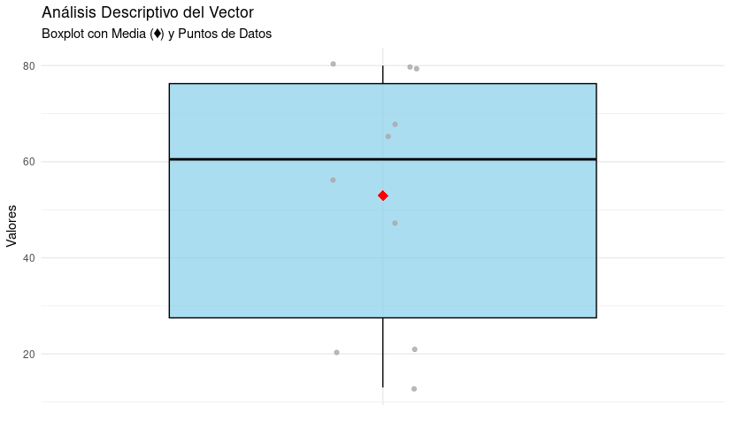

# Tarea 1: Estadística descriptiva de un vector

A continuación se muestra el código utilizado para analizar un vector numérico aleatorio de tamaño 10. La función `analyze_vector` calcula la media, mediana, moda, varianza y desviación estándar muestral del vector dado.

```r
analyze_vector <- function(input_vector) {
  mean_val <- mean(input_vector)
  median_val <- median(input_vector)
  freq_table <- table(input_vector)
  mode_val <- as.numeric(names(freq_table)[which.max(freq_table)])
  variance_val <- var(input_vector)
  sd_val <- sd(input_vector)
  return(list(
    mean = mean_val,
    median = median_val,
    mode = mode_val,
    variance = variance_val,
    sd = sd_val
  ))
}

my_vector <- sample(1:100, 10, replace = TRUE)
analysis_results <- analyze_vector(my_vector)
print(my_vector)
print(analysis_results)
```
La ejecución del script muestra en consola el vector generado y la lista con sus estadísticos básicos.
```cmd
Vector generado aleatoriamente: 56 47 21 13 80 65 20 79 68 80 
$mean
[1] 52.9

$median
[1] 60.5

$mode
[1] 80

$variance
[1] 695.6556

$sd
[1] 26.37528
```

Para ilustrar visualmente la distribución de los valores se genera un diagrama de caja (boxplot) mediante `ggplot2`.

```r
print(
  ggplot(data.frame(valores = my_vector), aes(x = "", y = valores)) +
    geom_boxplot(fill = "skyblue", color = "black", alpha = 0.7) +
    geom_jitter(color = "darkgray", width = 0.1, alpha = 0.8) +
    stat_summary(fun = mean, geom = "point", shape = 18, size = 4, color = "red") +
    labs(title = "Análisis Descriptivo del Vector",
         subtitle = "Boxplot con Media (♦) y Puntos de Datos",
         y = "Valores", x = NULL) +
    theme_minimal()
)
```



# Tarea 2: Tamaño de muestra para población finita

Se implementó la siguiente función para calcular el tamaño de una muestra usando la fórmula de poblaciones finitas:

```r
calculate_sample_size <- function(Z, p, q, N, e) {
  numerator <- Z^2 * N * p * q
  denominator <- e^2 * (N - 1) + Z^2 * p * q
  n <- numerator / denominator
  return(n)
}

n_result <-
  calculate_sample_size(Z = 1.96,
                        p = 0.95,
                        q = 0.05,
                        N = 1068,
                        e = 0.10)
print(paste("Tamaño de muestra n:", n_result))
```

La salida indica el tamaño de muestra requerido para los parámetros suministrados.

```cmd
"Tamaño de muestra n: 17.9575949304103"
```

# Tarea 3: Probabilidad total de A

De acuerdo con las instrucciones, si $P(A \cap B) = 0.18$ y $P(A \cap B^c) = 0.22$, entonces

$$P(A) = P(A \cap B) + P(A \cap B^c) = 0.18 + 0.22 = 0.40.$$

En el script se calcula de la siguiente forma:

```r
prob_A_B <- 0.18
prob_A_notB <- 0.22
prob_A <- prob_A_B + prob_A_notB
print(prob_A)
```

El resultado mostrado por consola es `0.4`, corroborando el cálculo manual.
